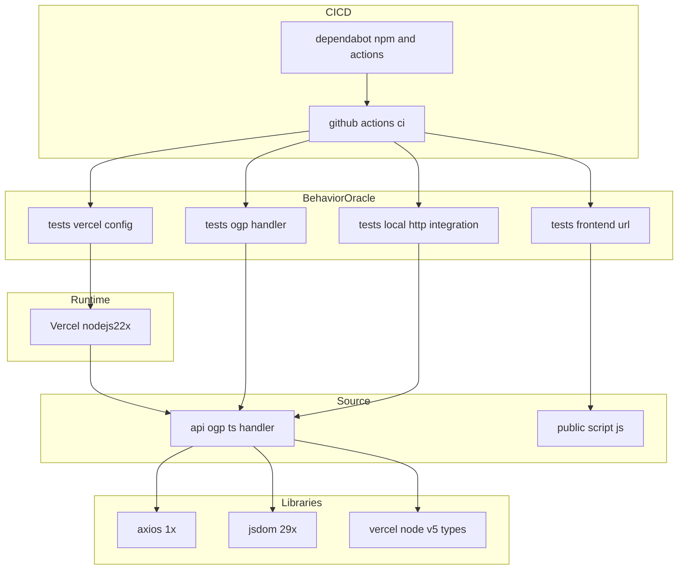
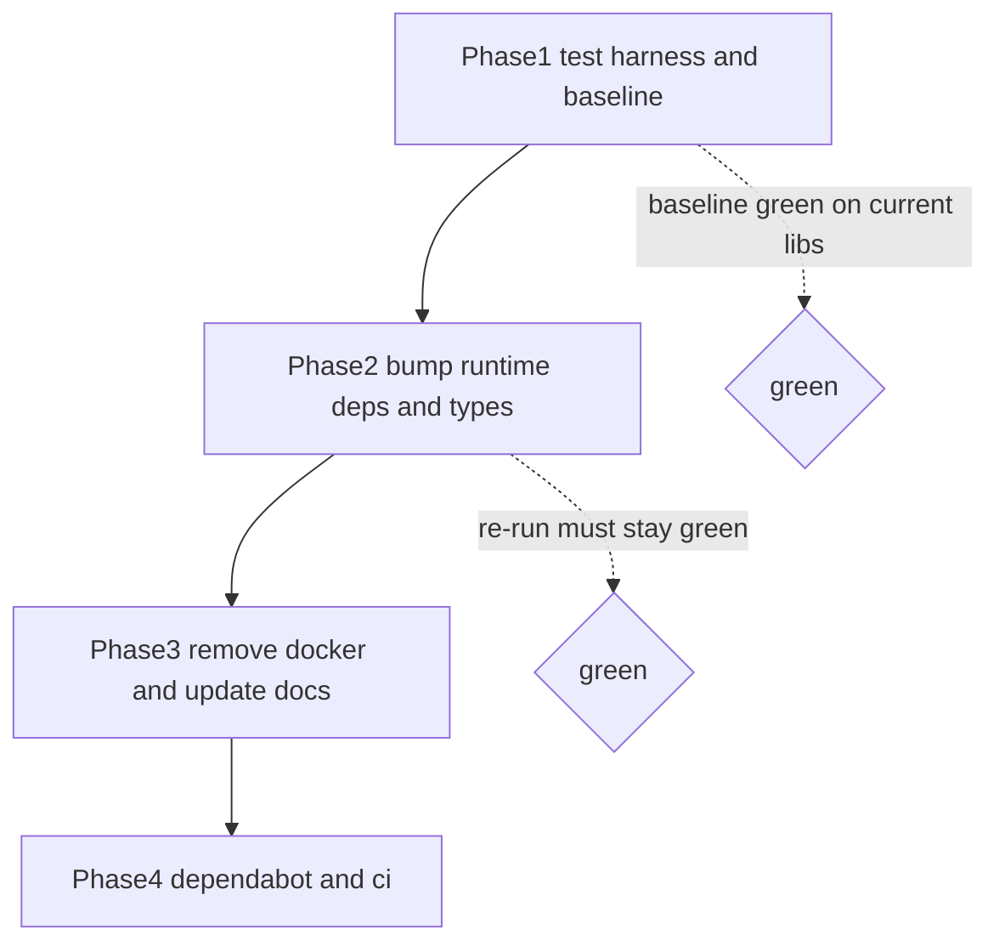

# Technical Design: legacy-modernization

## Overview

**Purpose**: 本スペックは、ogp-info（OGP抽出のサーバーレスAPI＋確認用の静的フロントエンド）の実行環境・依存を現行LTS水準へ最新化し、既存コードをリファクタリングしつつ、**外部から見た動作を一切変えない**ことをメンテナに提供する。

**Users**: 主な利用者はメンテナ（開発者本人）。API利用者・フロントエンド利用者は、更新の前後で同一の振る舞いを享受する（変化を認識しない）。

**Impact**: 現状の Node 14 / `@vercel/node` v1 / axios 0.24 / jsdom 16 / TS 4.5・非推奨型・EOLベースのDocker という構成を、Node 22 / `@vercel/node` v5 / axios 1.15 / jsdom 29 / TS 5・現行型へ更新し、Docker を廃止、Dependabot と CI（特性テスト自動実行）を新設する。動作の同一性は**特性テストスイート（振る舞いオラクル）**で機械的に担保する。

### Goals
- ランタイム・主要依存を現行LTS/最新安定版へ更新し、非推奨型を現行型へ移行する（R2）。
- 更新前の入出力を固定する特性テストを整備し、更新前後の振る舞い一致を自動検証する（R1・R3）。
- `docker/` を廃止し、ローカル開発を Node バージョンマネージャ＋`vercel dev` に一本化する（R4）。
- Dependabot と CI を導入し、依存更新PRごとに動作不変を自動検証できる状態にする（R5・R6）。

### Non-Goals
- OGP抽出機能の拡張、APIインターフェース・レスポンス形式の変更（明示的に禁止）。
- フロントエンドの機能追加・UI刷新・ビルド工程の導入。
- 本番デプロイ先（Vercelサーバーレス）の変更。
- HTTP取得ライブラリ・DOMパーサの置換（axios→fetch、jsdom→cheerio 等は動作を変えるため不採用）。

## Boundary Commitments

### This Spec Owns
- `api/ogp.ts` の型移行・リファクタリング（**観測可能な振る舞いは不変**）。
- `package.json` の `engines` と依存バージョン、`tsconfig.json` の新設。
- 特性テストスイート（`tests/`）と `vitest.config.ts`。
- `docker/` の削除と、それに伴う `README.md`・`.vercelignore` の更新。
- `.github/dependabot.yml`（依存監視）と `.github/workflows/ci.yml`（CI）。

### Out of Boundary
- OGP抽出のロジック変更・出力仕様変更（キー変換・null保持・エラー本文などの**挙動は保存対象であり変更しない**）。
- `vercel.json` のルーティング/CORS 定義の変更（**設定は不変のまま維持**し、テストで固定するのみ）。
- `public/*` の機能・UI変更（更新対象外。振る舞い保存のため原則非改変）。
- 本番実行環境（Vercel）そのものの構成変更。

### Allowed Dependencies
- 実行環境: Vercel Node.js ランタイム `nodejs22.x`（既存プラットフォーム）。
- ライブラリ: `@vercel/node`（型＋`vercel dev`）、`axios`（HTTP取得）、`jsdom`（DOMパース）。
- 開発/CI: `vitest`（テスト）、`typescript`、GitHub Actions・Dependabot（GitHub標準）。
- 制約: 新規の重い依存を追加しない（HTTP取得・DOMパース・テスト以外はライブラリを増やさない — steering方針）。

### Revalidation Triggers
- `GET /api/ogp` のレスポンス形式・ステータス・CORS 挙動が変わる場合（本スペックでは発生させない）。
- `engines.node` の対象メジャー変更（jsdom の `engines` 制約 `^22.13.0` に影響）。
- テストの振る舞いオラクル（期待値）を変更する場合 → R1 の再確認が必要。

## Architecture

### Existing Architecture Analysis
- **パターン**: Vercelサーバーレス（`api/`）＋ビルドレス静的配信（`public/`）。バックエンドは単一HTTPハンドラで状態を持たない。
- **維持する境界**: 1ファイル＝1エンドポイント、ハンドラ内の関数分割（入力取得・検証・本処理・エラー応答）、フロントとAPIの薄い結合。
- **維持する統合点**: `GET /api/ogp?url=` の入出力契約、`vercel.json` による CORS。
- **解消する技術的負債**: EOLランタイム、非推奨型、旧世代依存、テスト・依存監視・CIの不在、EOLベースのDocker。

### Architecture Pattern & Boundary Map



**Key Decisions**:
- **選定パターン**: 既存のサーバーレス＋静的配信を維持（新規パターン導入なし）。最新化はバージョン更新と型移行に限定し、責務境界を変えない。
- **振る舞いオラクル**: 特性テスト群を R1 の唯一の判定基準とし、R3（担保）・R6（CI自動実行）が共有する。
- **依存方向**: `Types → Handler → External libs`。テストは Handler/設定に依存（下流）。`public/*` は独立で他を import しない。上位（テスト・CI）から下位（ハンドラ・設定）への一方向のみ。

### Technology Stack

| Layer | Choice / Version | Role in Feature | Notes |
|-------|------------------|-----------------|-------|
| Frontend / CLI | Vanilla JS（`public/*`, 変更なし） | 確認用UI | 依存・ビルドなし。振る舞い保存のため非改変 |
| Backend / Services | TypeScript 5.x / `@vercel/node` 5.x | OGP抽出ハンドラ | `NowRequest/NowResponse`→`VercelRequest/VercelResponse` |
| Backend libs | axios 1.15.x / jsdom 29.x | HTTP取得 / DOMパース | 据え置き（置換しない）。jsdomはCJS・`engines ^22.13.0` |
| Infrastructure / Runtime | Vercel `nodejs22.x` / `engines.node >=22.13.0` | 実行環境 | jsdom要件を満たすため 22.13 以上でピン |
| Test / CI | Vitest / GitHub Actions / Dependabot | 特性テスト・自動検証・依存監視 | 新規導入 |

> `@vercel/node` は現行メジャー **v5** を採用（要件 2.2 と一致。研究ログ §3 参照）。

## File Structure Plan

### New Files
```
tsconfig.json                 # TSコンパイラ設定（strict:true, target/module ベースライン）
vitest.config.ts              # テストランナー設定（environment: node, tests/ を対象）
tests/
├── ogp.test.ts               # ハンドラ特性テスト（axios.getをモック：抽出・キー変換・null・エラー・content-type）
├── ogp.integration.test.ts   # ローカルhttpサーバ＋実axios/jsdomで本文取り扱いの版差を固定
├── vercel-config.test.ts     # vercel.json が /api/ogp に CORS ヘッダを付与することをアサート（R1.5）
└── frontend.test.ts          # public/script.js の get_ogp がURLを組み立て新タブで開くことを固定（R1.6）
.github/
├── dependabot.yml            # npm＋github-actions を weekly 監視（R5）
└── workflows/ci.yml          # PR（Dependabot含む）で typecheck＋test を Node 22 実行（R6）
```
> フィクスチャHTMLは小さいため各テスト内にインラインで保持（新規ファイルにしない）。

### Modified Files
- `package.json` — `engines.node` を `>=22.13.0` へ；`@vercel/node`→5.x・`axios`→1.15.x・`jsdom`→29.x・`typescript`→5.x へ更新；`vitest` を devDependencies に追加；`scripts` に `test`（`vitest run`）・`typecheck`（`tsc --noEmit`）を追加。
- `api/ogp.ts` — `NowRequest/NowResponse`→`VercelRequest/VercelResponse` に置換；`strict` 有効化に伴う null 安全化（**非null断言等で挙動不変**）；不要な `<string>` 旧式キャストの整理。関数分割・出力挙動は不変。
- `README.md` — Docker手順（build.sh/run.sh）を削除し、Node バージョンマネージャ＋`vercel dev` によるローカル手順と `npm test` を記載。
- `.vercelignore` — `docker` 行を削除（`.github` の除外は維持）。
- `package-lock.json` — `npm install` により再生成（生成物）。

### Deleted Files
- `docker/`（`Dockerfile`, `_config.sh`, `build.sh`, `run.sh`, `.dockerignore`）— ローカル開発専用コンテナを廃止（R4.1）。

## Requirements Traceability

| Requirement | Summary | Components | Interfaces | Flows |
|-------------|---------|------------|------------|-------|
| 1.1, 1.2 | 成功時JSON・抽出範囲・キー変換の不変 | api/ogp.ts, tests/ogp.test.ts, tests/ogp.integration.test.ts | Handler API契約 | 特性テスト検証 |
| 1.3 | 入力不正（未指定/配列/空）で400 error | api/ogp.ts, tests/ogp.test.ts | Handler API契約 | エラー経路 |
| 1.4 | 取得/パース失敗で400 error | api/ogp.ts, tests/ogp.test.ts, tests/ogp.integration.test.ts | Handler API契約 | エラー経路 |
| 1.5 | CORSヘッダ不変 | vercel.json, tests/vercel-config.test.ts | 設定契約 | 設定アサート |
| 1.6 | フロント操作/遷移の不変 | public/script.js, tests/frontend.test.ts | フロントURL組立 | フロント検証 |
| 1.7 | 変更を通じた振る舞い不変 | 全テスト | 振る舞いオラクル | CI検証 |
| 2.1 | Node 22系宣言 | package.json, .github/workflows/ci.yml | engines/CI | — |
| 2.2 | `@vercel/node` v5 | package.json, api/ogp.ts | 型契約 | — |
| 2.3 | 主要依存の最新化 | package.json | — | — |
| 2.4 | 非推奨API/型の移行 | api/ogp.ts | 型契約 | — |
| 2.5 | 関数分割維持・挙動不変 | api/ogp.ts | Handler内部構造 | — |
| 2.6 | 更新中の振る舞い不変 | 全テスト | 振る舞いオラクル | Migration |
| 3.1 | 更新前ベースライン確立 | tests/*, package.json | — | Migration |
| 3.2 | 代表入出力の固定 | tests/ogp.test.ts, tests/vercel-config.test.ts | — | — |
| 3.3 | 一致検証・不一致で失敗 | tests/*, vitest.config.ts | — | CI |
| 3.4 | 単一コマンド実行 | package.json scripts | `npm test` | — |
| 3.5 | 外部アクセス非依存 | tests/ogp.test.ts, tests/ogp.integration.test.ts | モック/ローカルhttp | — |
| 4.1 | docker/削除 | docker/（削除） | — | — |
| 4.2, 4.3 | 開発手順の一本化・ドキュメント更新 | README.md | — | — |
| 4.4 | デプロイ挙動不変 | .vercelignore, vercel.json | — | — |
| 5.1–5.4 | Dependabot監視 | .github/dependabot.yml | Dependabot設定 | — |
| 6.1–6.4 | CIで特性テスト自動実行 | .github/workflows/ci.yml | CIワークフロー | CI |

## Components and Interfaces

| Component | Domain/Layer | Intent | Req Coverage | Key Dependencies (P0/P1) | Contracts |
|-----------|--------------|--------|--------------|--------------------------|-----------|
| OGP Handler | Backend | OGP抽出（挙動不変で最新化） | 1.1–1.4, 2.2, 2.4, 2.5 | axios (P0), jsdom (P0), @vercel/node types (P0) | API |
| Characterization Suite | Test | R1の振る舞いオラクル | 1.1–1.7, 3.1–3.5 | OGP Handler (P0), vercel.json (P1), script.js (P1) | Service |
| CI Workflow | Infra | PR毎に特性テスト自動実行 | 6.1–6.4 | Characterization Suite (P0) | Batch |
| Dependabot Config | Infra | 依存の継続監視 | 5.1–5.4 | CI Workflow (P1) | State |

### Backend

#### OGP Handler (`api/ogp.ts`)

| Field | Detail |
|-------|--------|
| Intent | 対象URLのOGPを抽出しJSONで返す（**挙動不変のまま最新化**） |
| Requirements | 1.1, 1.2, 1.3, 1.4, 2.2, 2.4, 2.5 |

**Responsibilities & Constraints**
- 入力取得・検証（`getUrlParameter`/`isValidUrlParameter`）、取得＋パース＋抽出、エラー応答（`errorResponce`）の分割を維持。
- **保存すべき現行挙動（実装で改変禁止）**: キー = `property.trim().replace("og:", "")`（非アンカー・最初の1回置換）、値 = `getAttribute("content")`（欠落時 `null`）、`url` 未指定/配列/**空文字** → 400、例外 → 400、エラー本文はプレーンテキスト `error`、成功は `application/json`。

**Dependencies**
- External: axios 1.15.x — 対象URLのHTTP取得（P0）
- External: jsdom 29.x — `head > meta` のパース・走査（P0、CJS・Node 22.13+）
- External: `@vercel/node` 5.x — `VercelRequest`/`VercelResponse` 型（P0）

**Contracts**: Service [ ] / API [x] / Event [ ] / Batch [ ] / State [ ]

##### API Contract
| Method | Endpoint | Request | Response | Errors |
|--------|----------|---------|----------|--------|
| GET | /api/ogp | query `url: string`（単一・非空） | 200 `application/json` `{ [propertyWithoutOgPrefix]: content \| null }` | 400 `text` `error`（未指定/配列/空/取得失敗/パース失敗） |

- Preconditions: `url` が単一の非空文字列。
- Postconditions: 成功時、`<head> > meta[property]` のみを対象に更新前と同一のキー変換・null保持でJSONを返す。
- Invariants: レスポンス形式・ステータス・CORS（vercel.json由来）は更新前と同一。

**Implementation Notes**
- Integration: 署名は `export default async function(req: VercelRequest, res: VercelResponse)` を維持。`req.query.url` は `string | string[] | undefined` 前提で既存検証をそのまま活用。
- Validation: `strict:true` 化で `getAttribute("property").trim()` の null 型エラーは、`filter(hasAttribute("property"))` で実行時保証済みのため**非null断言で解消（挙動不変）**。
- Risks: axios/jsdom メジャー跨ぎの微小な挙動差 → 特性テスト（特に integration）で検出・固定。

### Test

#### Characterization Suite (`tests/`)

| Field | Detail |
|-------|--------|
| Intent | 更新前の観測可能な振る舞いを固定し、更新前後の一致を検証する振る舞いオラクル |
| Requirements | 1.1–1.7, 3.1–3.5 |

**Responsibilities & Constraints**
- 単一コマンド `npm test`（`vitest run`）で全件実行（3.4）。外部サイトへ実アクセスしない（3.5）。
- 2層で構成:
  - **Unit**（`ogp.test.ts`）: `vi.mock("axios")` で `axios.get` を固定HTMLに差し替え、default ハンドラを mock `req`/`res` で invoke。抽出範囲・キー変換・null保持・入力不正(未指定/配列/空)の400・例外時の400・成功のcontent-typeを検証。
  - **Integration**（`ogp.integration.test.ts`）: Node標準 `http` で固定HTMLを返すローカルサーバを起動し、実 axios＋jsdom を通したハンドラ出力を検証（axios自身の本文取り扱い＝responseType/エンコーディングの版差を固定）。localhost限定で3.5準拠。
- `vercel-config.test.ts`: `vercel.json` を読み、`/api/ogp` に `Access-Control-Allow-Origin: *` が対応することをアサート（1.5、稼働サーバ不要）。
- `frontend.test.ts`: **`public/script.js` を非改変のまま**検証する。jsdom を `runScripts: "dangerously"` で生成した window に `#target-url` 要素を用意し、`script.js` のソースを読み込んでグローバル `get_ogp` を定義、`window.open` をスタブして `get_ogp()` 呼び出し後に `open` が `/api/ogp?url=<入力値>` ＋ `_blank` で呼ばれることを固定（1.6）。フロントは本スペックで改変しないため、本テストは非改変の追認と位置づける（機構が過剰と判明した場合は URL 組立ロジックの最小ユニット検証へ縮退してよい）。

**Dependencies**
- Inbound: CI Workflow — 実行主体（P0）
- Outbound: OGP Handler（P0）、vercel.json（P1）、public/script.js（P1）

**Contracts**: Service [x] / API [ ] / Event [ ] / Batch [ ] / State [ ]

##### Service Interface
```typescript
// テストが依存するモック契約（型の意図を明示）
interface MockVercelResponse {
  status(code: number): this;
  json(body: unknown): void;
  send(body: string): void;
}
interface CapturedResponse {
  statusCode: number;
  jsonBody?: Record<string, string | null>;
  textBody?: string;
}
```
- Preconditions: 期待値は更新前の実装挙動から導出。
- Postconditions: 不一致時は失敗する（3.3）。
- Invariants: 期待値（振る舞いオラクル）の変更は R1 の再確認を伴う（Revalidation Trigger）。

**Implementation Notes**
- Integration: ハンドラは default export を直接 import して invoke（稼働サーバ不要）。
- Validation: ベースラインは**現行ライブラリ版で Node 22 上で緑**を確認してから bump（Migration 参照。Vitest は Node 18+ 必須のため Node 14 では実行しない）。
- Risks: フロントテストは `script.js` を関数として評価する必要がある（グローバル関数のため、jsdom window へ読み込む方式を採る）。

### Infra

#### CI Workflow (`.github/workflows/ci.yml`)

| Field | Detail |
|-------|--------|
| Intent | PR（Dependabotの更新PR含む）で特性テストを Node 22 上で自動実行 |
| Requirements | 6.1, 6.2, 6.3, 6.4 |

**Contracts**: Service [ ] / API [ ] / Event [ ] / Batch [x] / State [ ]

##### Batch / Job Contract
- Trigger: `on: pull_request`（同一リポジトリのDependabotブランチも発火）＋ `push: [main]`。
- Input / validation: `actions/setup-node@v4`（node-version 22）→ `npm ci` → `npm run typecheck` → `npm test`。
- Output / destination: いずれか失敗時にチェック失敗を報告（6.3）。
- Idempotency & recovery: 参照透明（同一コミットで同一結果）。**シークレット不要のため `pull_request` を使用し `pull_request_target` は使わない**（Dependabot PRの安全実行、研究ログ Research Needed #4）。

**Implementation Notes**
- Integration: `permissions` は最小（`contents: read`）。テスト実行のみで書き込み不要。
- Risks: なし（外部サービス連携なし）。

#### Dependabot Config (`.github/dependabot.yml`)

| Field | Detail |
|-------|--------|
| Intent | npm と GitHub Actions の依存を継続監視し更新PRを自動作成 |
| Requirements | 5.1, 5.2, 5.3, 5.4 |

**Contracts**: Service [ ] / API [ ] / Event [ ] / Batch [ ] / State [x]

##### State Management
- State model: `version: 2`、`updates` に `package-ecosystem: npm`（`directory: /`, `schedule.interval: weekly`）と `package-ecosystem: github-actions`（`directory: /`, `schedule.interval: weekly`）。
- Persistence & consistency: 監視対象エコシステムと頻度を設定に明示（5.4）。
- Concurrency strategy: Dependabot 標準（エコシステム毎にPR）。作成された更新PRは CI Workflow により検証される（6.2）。

## Error Handling

### Error Strategy
本スペックは**新規のエラー分類を導入しない**。ハンドラのエラー挙動は更新前と同一（`errorResponce` に集約、400・プレーンテキスト `error`）を厳守する。

### Error Categories and Responses
- **User Errors (400)**: `url` 未指定/配列/空文字 → `errorResponce`（挙動不変）。
- **System Errors (400)**: 取得失敗・パース失敗（例外）→ catch → `errorResponce`（**現行どおり 5xx ではなく 400**。この非慣用的挙動も保存対象）。

### Monitoring
Vercel標準のログに委譲。本スペックで監視機構は追加しない。

## Testing Strategy

### Unit Tests（`tests/ogp.test.ts`、axios.getモック）
1. 複数の `og:` メタ＋非`og:` の `property` メタ＋`property` 無しメタを含むHTML → `og:` 除去・trim済みキーのみを抽出し、非対象を除外（1.1, 1.2）。
2. `property` はあるが `content` 無しのメタ → 当該キーの値が `null`（1.1）。
3. `url` 未指定 / 配列（複数指定） / 空文字 → 400・`error`（1.3）。
4. `axios.get` が reject → 400・`error`（1.4）。
5. 成功時に `res.json` が呼ばれ `application/json` 相当で返る（1.1、content-type）。

### Integration Tests（`tests/ogp.integration.test.ts`、ローカルhttp＋実axios/jsdom）
1. ローカルサーバが固定HTMLを返す → 実 axios 経由でも Unit と同一のJSONを得る（axiosの本文取り扱い版差を固定、1.1/1.4）。
2. ローカルサーバが 500 を返す or 接続不可 → 400・`error`（1.4）。
3. （実測記録）ローカルサーバが非HTML（2xx、JSON/プレーンテキスト等）を返す → axiosのforced JSON parsingとjsdomの非文字列入力の`String()`強制変換により例外は発生せず、200・空オブジェクト`{}`になる（400にはならない）。この現行実装の実際の挙動をベースラインとして固定する（1.1/1.4、Task 2.2で確定・Task 3.3で新ライブラリ版でも一致を確認済み）。

### Config / Frontend Tests
1. `tests/vercel-config.test.ts`: `vercel.json` の `/api/ogp` ルートに `Access-Control-Allow-Origin: *` が存在（1.5）。
2. `tests/frontend.test.ts`: `get_ogp` が入力値から `/api/ogp?url=<値>` を組み立て `window.open(url, "_blank")` を呼ぶ（1.6）。

### CI 実行
- `npm run typecheck` ＋ `npm test` を Node 22 で実行し、失敗時にPRチェックを落とす（3.3, 6.1–6.4）。

## Migration Strategy



- **Phase 1（ベースライン）**: `tsconfig.json`・`vitest.config.ts`・`tests/*` を追加。**現行ライブラリ版のまま Node 22 上でテストを緑**にし、振る舞いオラクルを確定（3.1）。Vitest は Node 18+ 必須のため、ベースライン検証は Node 14 ではなく Node 22 で行い、変数を「ライブラリ版」に限定する。
- **Phase 2（最新化）**: `engines.node`・依存を更新、型移行と strict 化の null 安全化。テストを再実行し**緑を維持**（不一致は振る舞い変化＝要修正、2.6/1.7）。
- **Phase 3（Docker廃止）**: `docker/` 削除、`README.md`・`.vercelignore` 更新（4.x）。デプロイ挙動は不変。
- **Phase 4（継続更新）**: `.github/dependabot.yml`・`.github/workflows/ci.yml` 追加（5.x/6.x）。
- **Rollback**: 各Phaseは独立コミット。テストが赤に転じた時点で当該Phaseを差し戻す。

## Behavior Delta Resolution Policy（版差検出時の決定規則）

R1 は「一切変更しない」という**絶対制約**であり、依存更新（R2）と衝突し得る。integration テストで更新前後の差分が検出された場合、以下の順で対処する（黙って受容しない）:

1. **旧挙動を明示復元**: axios の `responseType`・`transformResponse`・`maxRedirects` 等、または jsdom のパースオプションを設定し、更新前と同一の出力へ戻す。復元後にテストが緑になれば完了。
2. **復元不能な差分**: 明示設定で旧挙動へ戻せない場合は、R1（保存優先）と R2（最新化）の**要件衝突**として扱い、実装を止めて要件フェーズへ差し戻す（`/kiro-spec-requirements` 再確認）。実装者の独断で挙動変更を受容してはならない。
3. **判定基準の権威**: 差分の有無は integration テスト（ローカルhttp＋実axios/jsdom）を正とする。unit テスト（axiosモック）はハンドラ変換ロジックの固定に用い、axios自身の版差判定には用いない。

## Open Questions / Risks
- **axios/jsdom 版差**: 最大リスク。Phase 1 のベースライン→Phase 2 の再実行（特に integration テスト）で機械検出し、上記 Behavior Delta Resolution Policy に従って対処。
- **strict化の null 安全**: 挙動を変えず型を満たす（非null断言）。「改善」による挙動変更を review で禁止。
- **tsconfig 詳細**: `strict:true`・`noEmit`（型検査用）を必須制約とし、`target`/`module`（CJS前提でjsdom互換）等の具体値は実装裁量。`vercel dev`/ビルドが tsconfig を要求するかは Phase 2 で確認（研究ログ Research Needed #1）。
- **Phase 1 ベースラインの範囲**: Phase 1 の緑判定は `npm test`（Vitest。型はesbuildで除去されるため旧`@vercel/node`型でも実行可）を指す。`npm run typecheck` の緑は型移行・null安全化を終えた Phase 2 の成果であり、typecheck＋testを走らせる CI（`ci.yml`）は Phase 4（Phase 2 以降）に配置する。
